Tour Into the Picture
=============
Overview
-------------
This is an interactive three.js based web program that generates a 3D scene model from an image (the process is known as single view reconstruction). It follows the techniques described in [Tour Into the Picture](http://graphics.cs.cmu.edu/courses/15-463/2011_fall/Papers/TIP.pdf) by Horry et al., modeling the scene as an axis-parallel box with five faces. 

  
  
The box layout

Objectives
-------------
Through this project I wish to accomplish the following:
- Build something with the three.js library.
- Review computer graphics concepts, such as coordinate systems (local, world, screen), transformation matrices and raytracing (for user interaction).
- Figure out the implementation of the functionalities (the paper leaves out the description of the process).

Instructions
-------------
To use the program, first upload an image of your choice. Input images that work best have a single-vanishing-point perspective and show each of the five planes clearly. The image/ folder contains some valid input pictures. 

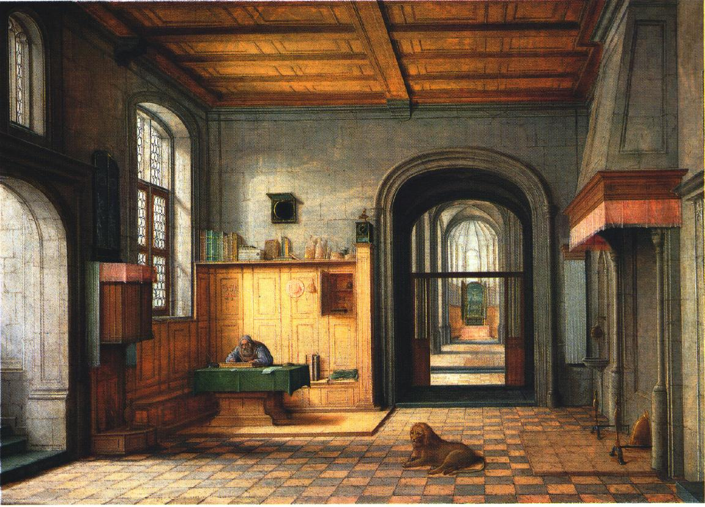
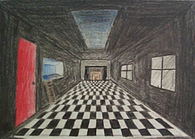
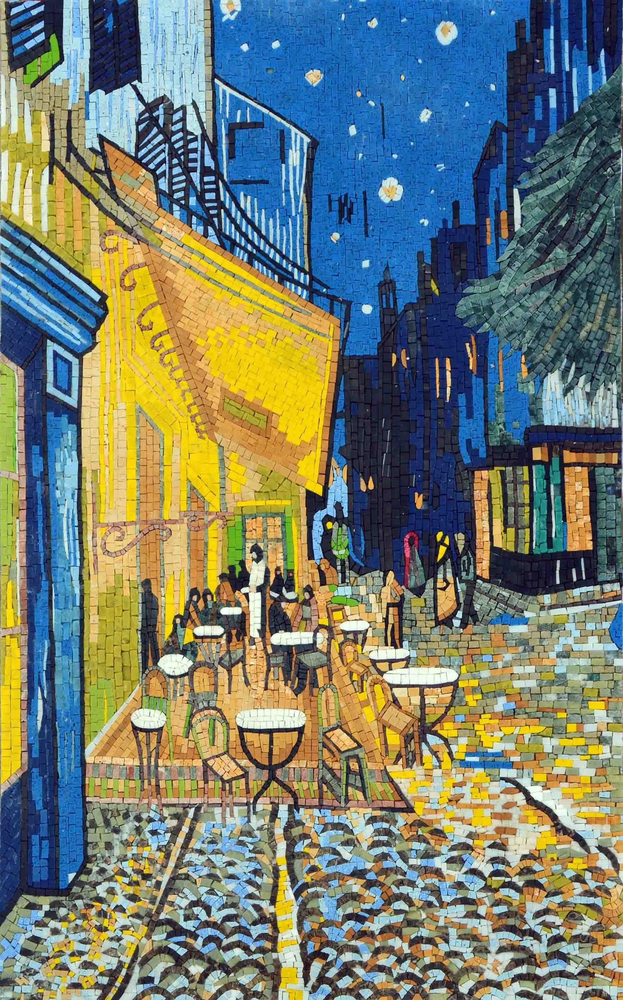

As for the second part of input, indicate the vanishing point and the back plane of the box by dragging around the blue control points on the image plane. The program will update the vanishing lines connecting the vanishing points to the corners of the back plane. Try to make them match the perspective lines in the original input image as closely as possible. 

If there are any foreground objects in the picture such as a dog or a man, you can create planes for them in the constructed scene. You can also inpaint the image by removing those foreground objects from the background. To do so, create foreground masks by clicking and dragging a box around the objects. You can create multiple foreground boxes in one image. 

After you select the foreground objects, you may click the "Inpaint Image" button to generate an image with those objects removed from the scene. The Exemplar based inpainting algorithm will select the best matching region from the background parts and patch it to cover the foreground mask boxes. Since this process is calculation heavy, it may take a long time to complete. It's recommended to start with smaller images or skip this step first.

Once the above steps are finished, we can construct the 3D box scene based on the specified coordinates. The process includes calculating 3D coordinates of the box from the 2D specified points, and rectifying each of the five image sections using perspective transform. Finally, we construct the geometry and apply the textuers to its five faces. If foreground masks are provided, an individual plane will be created for each object. Pixels detected as background will be removed from the rectangle mapping and become transparent. The user can move around inside of the box in order to look at the scene from different perspectives. Alternatively, once the scene has been constructed, the user can click Tour Scene, and an animated scene walkthrough will be displayed. Enjoy!

Details
-------------
### Calculate scene dimensions and plane positions ###
Once the user labels the vanishing point and back wall, how do we get the dimensions and coordinates of the planes? I realized the way is through the principles of similar triangles. 

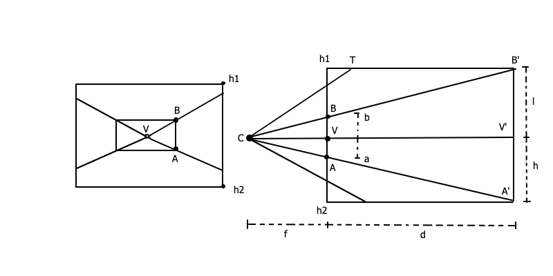

The left one represents the labeled image. V is the vanishing point, and A and B are the bottom and top corners of the rear plane. The right drawing is the side view of the same image, where d represents the depth of the scene. C is the camera position, and f is the focal length. h1 and h2 mark the top and bottom coordinates of the photograph, which is the image itself. 

Reading from the labeled image, we can get the vanishing point's location and the lengths of a and b in pixels. We can also get the focal length of the camera. The width and height of the rear plane will be the same as the image. Therefore the only missing value is the depth of the box d. CVA and CV'A', CVB and CV'B' are two pairs of similar triangles. Based on the properties of similar triangles, . Set h = V.y - h2, l = h1 - V.y. Then, the depths of the top and bottom planes can be calculated as  and .

Similarly, we can calculate d_left, d_right as well as the depth, width and height of the foreground objects.

### Inpaint ###
The inpainting algorithm is based on the paper [Region Filling and Object Removal by Exemplar-Based Image Inpainting](https://www.microsoft.com/en-us/research/wp-content/uploads/2016/02/criminisi_tip2004.pdf) by A. Criminisi et al. The main idea is to complete the image using pixel information from the background pixels. The workflow can be summarized as the following steps:

 - Starting from the border of the inpaint region, calculate priorities of the pixels along the border
 - Pick the pixel with the highest priority and the region around it
 - Select the region closest to the inpaint region from rest of the image
 - Use the best match region as patch to fill the inpaint region
 - Repeat until all pixels are filled
 
 

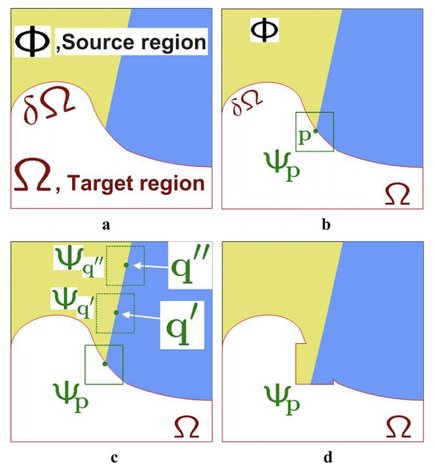
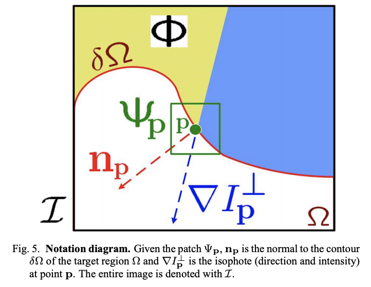

The priority of an inpaint pixel is calculated using the equation , where  is the confidence of the pixel, calculated as , while  the data term is expressed as .  

The simplest method to calculate the similarity between a background region and the inpaint region is through the square difference. For more accurate results, we can combine the square difference with euclidean distance (best matching regions are usually the closest), gradient, or both. You can choose from the four methods. However, since we would need to compare all possible source regions in the image with the target region, finding the best region is the most time-consuming part of our steps.

### Foreground extraction ###
To remove extra background surrounding the objects from the foreground masks, I used the Grabcut image segmentation algorithm that estimates the color distribution of the target object and that of the background using a Gaussian mixture model. It's available in opencv.js and I followed this [tutorial](https://docs.opencv.org/master/dd/dfc/tutorial_js_grabcut.html).

Gallery
-------------
Below are some images produced from the program. As you can see, after the reconstruction, we can generate new perspectives of the scene from only one image.

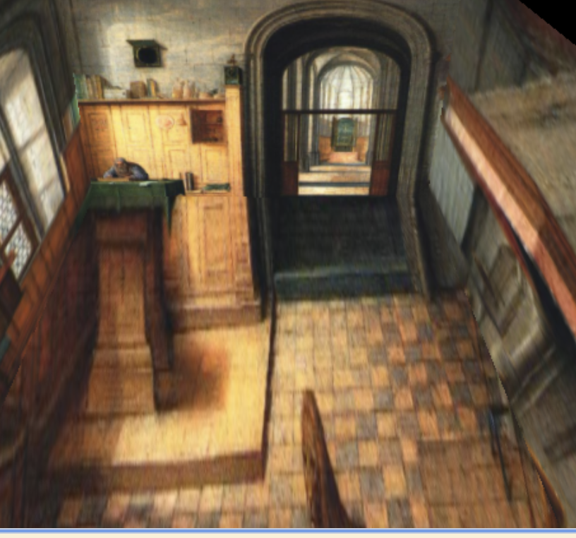
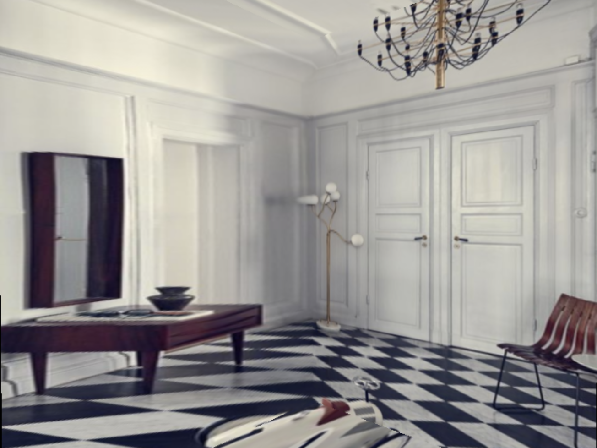
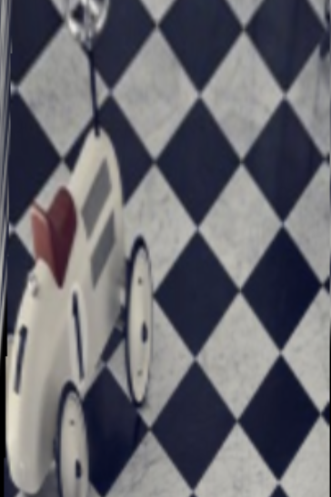

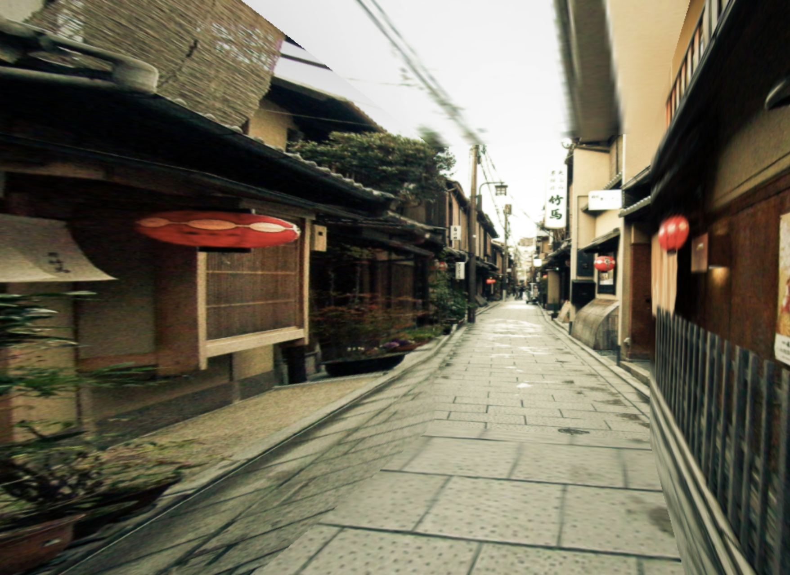
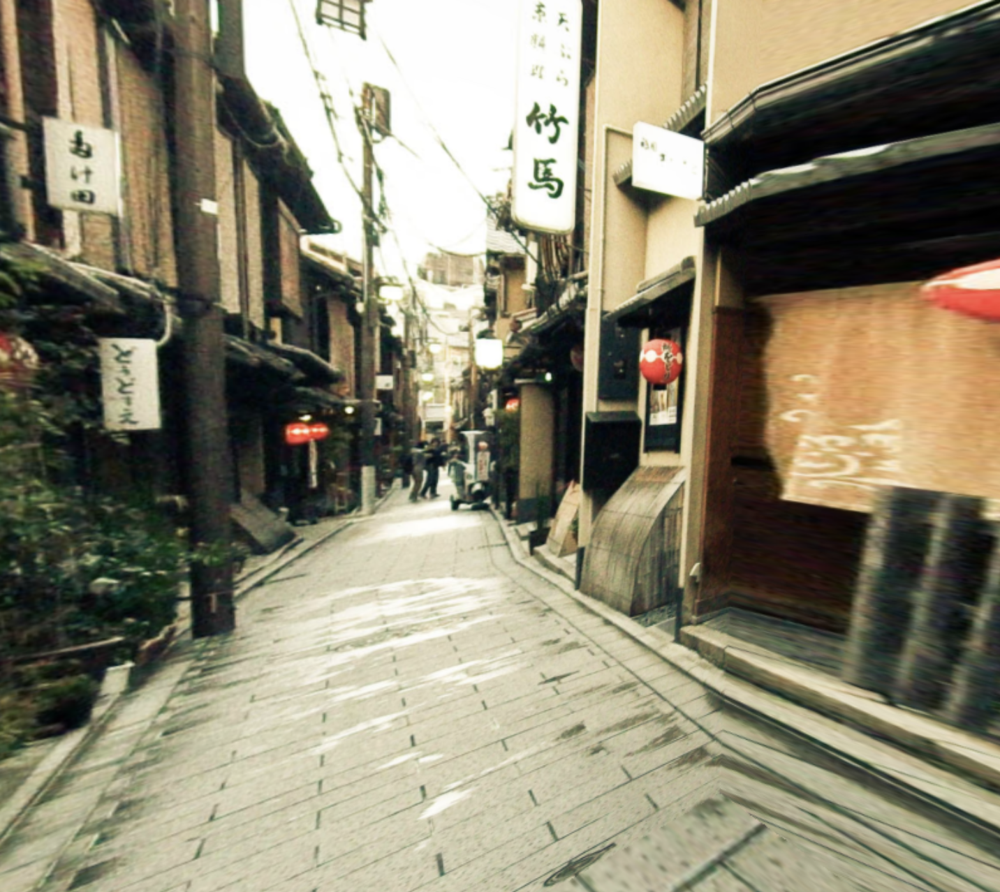

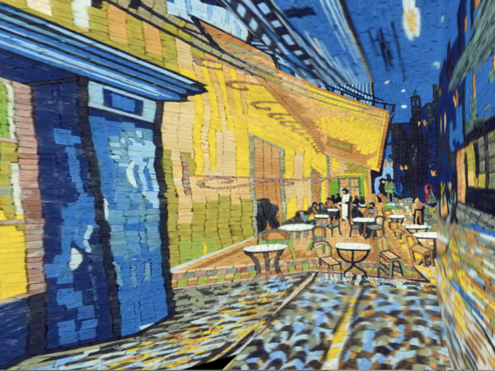

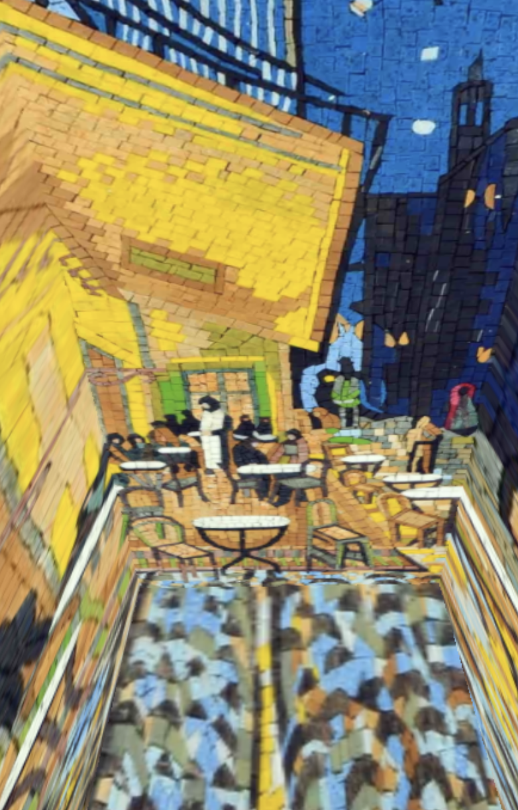

Here are some "tours" into the images:

  
  
  
  
  

