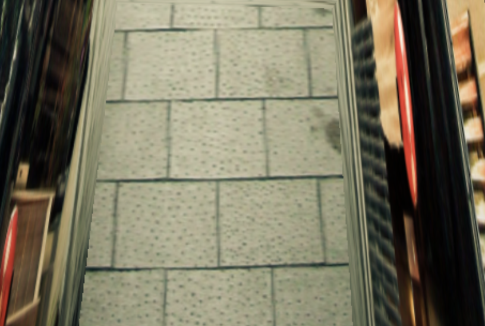

Tour Into the Picture
=============
Overview
-------------
This is an interactive three.js based web program that generates a 3D scene model from an image (the process is known as single view reconstruction). It follows the techniques described in [Tour Into the Picture](http://graphics.cs.cmu.edu/courses/15-463/2011_fall/Papers/TIP.pdf) by Horry et al., modeling the scene as an axis-parallel box with five faces. 

  
  
The box layout

Objectives
-------------
Through this project I wish to accomplish the following:
- Build something with the three.js library.
- Review computer graphics concepts, such as coordinate systems (local, world, screen), transformation matrices and raytracing (for user interaction).
- Figure out the implementation of the functionalities (the paper leaves out the description of the process).

Instructions
-------------
To use the program, first upload an image of your choice. Input images that work best have a single-vanishing-point perspective and show each of the five planes clearly. The image/ folder contains some valid input pictures. 

As for the second part of input, indicate the vanishing point and the back plane of the box by dragging around the blue control points on the image plane. The program will update the vanishing lines connecting the vanishing points to the corners of the back plane. Try to make them match the perspective lines in the original input image as closely as possible. 

Once the above step is finished, we can construct the 3D box scene based on the specified coordinates. The process includes calculating 3D coordinates of the box from the 2D specified points, and rectifying each of the five image sections using perspective transform. Finally, we construct the geometry and apply the textuers to its five faces. The user can move around inside of the box in order to look at the scene from different perspectives. Alternatively, once the scene has been constructed, the user can click Tour Scene, and an animated scene walkthrough will be displayed. Enjoy!

Gallery
-------------
Below are some images produced from the program. As you can see, after the reconstruction, we can generate new perspectives of the scene from only one image.

Here is a sample "tour" into an image:

  

